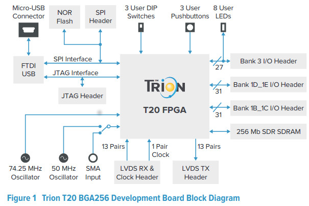
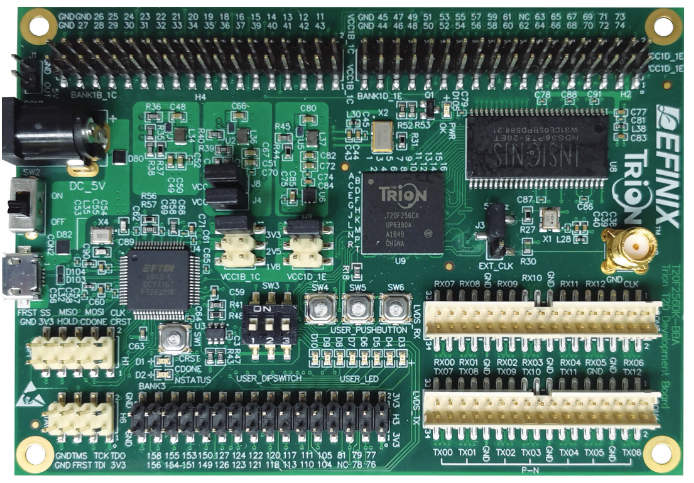
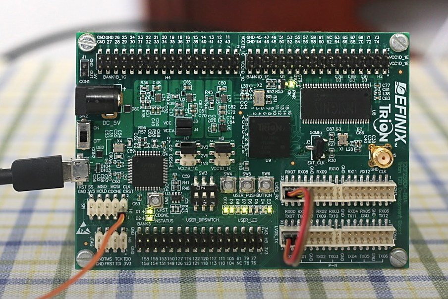

# ManchesterIP
```
.--,       .--,                                                        
( (  \.---./  ) )        
'.__/o   o\__.'
   {=  ^  =}
    >  -  <
__.""`-------`"".__
/                   \
\ Manchester IP     /
/                   \
\___________________/
  ___)( )(___
 (((__) (__)))

 ____   ___ ____   ___   ___ ____   ___ ____  
|___ \ / _ \___ \ / _ \ / _ \___ \ / _ \___ \
  __) | | | |__) | | | | | | |__) | | | |__) |
 / __/| |_| / __/| |_| | |_| / __/| |_| / __/
|_____|\___/_____|\___/ \___/_____|\___/_____|


update in

 ____   ___ ____  _  ___ ____  _ _____
|___ \ / _ \___ \/ |/ _ \___ \/ |___  |
  __) | | | |__) | | | | |__) | |  / /
 / __/| |_| / __/| | |_| / __/| | / /  
|_____|\___/_____|_|\___/_____|_|/_/   


```
## Description

> 项目的目的：

> 在工业控制的领域， PLC， Servo接口， 多模块链接， 都要求数字输入输出模块之间需要有快速可靠抗干扰性强的链接方案， EtherCAT的模块之间链接也是采用这种方式，

- 满足**GB/T31230.2**和**IEC61158**的标准要求；（附件是GB/T31230.2）  
- 和**倍福的EBus**能实现对接；
- 从一级到下一级的整个传输到译码时间**低于250ns**,性能比当前工业控制的10M信号1-2us的时间**提高6倍以上**


> **易灵思公司的ManchesterIP将过去EtherCAT的应用中的数字链路有效提高到100M信号带宽， 可以使中国国产的PLC如果使用该链路， 实时响应的带宽得到极大的提高，在响应速度上将与日本基恩士公司的高速模块之间的接口相当**


你可以通过这个项目， 来快速了解如何使用Efinix FPGA的LVDS， PLL，以及伪随机编码构建一个Manchester 接口的PHY


 Trion FPGA ManchesterIP Solution based on LVDS interface


2019-10-2 V1.0  


## 正式发布的第一个版本


功能：

1- 提供系统时钟灵活的MII接口，可以很方便的和内部逻辑链接；  
2- 将MII转成串行数据，并经LVDS发送Manchester编码；  
3、接收Manchester编码的流，进行整形、滤波、定界、译码的算法，最后恢复出数据，并转成MII接口；
4、提取Manchester编码的时钟；时钟抖动小于20ns;  
5、测量接收时钟和本地时钟的误差，测量精度0.25ppm；  
6、精密的容错算法和码流跟踪算法，可达大于200ppm的频率偏差容限；（与信号质量有关）  

## 模块资源占用情况
===============================
- EFX_ADD         : 	183
- EFX_LUT4        : 	341
- EFX_FF          : 	388
- EFX_RAM_5K      : 	3
- EFX_GBUFCE      : 	4  

===============================

## __Total resource__

- **676LEs  3BRAMs**

模块性能：
```
Clock Name      Period (ns)   Frequency (MHz)   Edge
SysClk              6.270         159.496     (R-R)
TxMcstClk           4.275         233.920     (R-R)
RxMcstClk           7.546         132.512     (R-R)

```

> 较上个版本：  

1、去掉了多余的DPLL等实际使用中基本不用的模块；  
2、提高了时钟恢复时钟的性能；  
3、去掉了Debuger里平时使用的很少的信号  
4、提高了稳定性


2019-10-2 V1.1
===
1、增加了MII环回功能；  
2、在VIO中增加了CtrlMiiLoop的信号；  
3、增加了对没有数据的判断，如果数据不连续，D0闪，最后的状态Right无效快闪  

2020-01-14 V1.2
===
1、去掉了调试代码；  
2、优化了代码，减少了近200LEs；  
3、把Tx和Rx分开；  

```
EFX_ADD         : 	67
EFX_LUT4        : 	260
EFX_FF          : 	296
EFX_RAM_5K      : 	3
EFX_GBUFCE      : 	3
```

V1.2优化后的最终结果是：
```
---------- Resource Summary (begin) ----------
Inputs:             	17 / 470 (3.62%)
Outputs:            	18 / 595 (3.03%)
Clocks:                 3 / 16 (18.75%)
Logic Elements:     472 / 19728 (2.39%)
LE: LUTs/Adders:  329 / 19728 (1.67%)
LE: Registers:    296 / 13920 (2.13%)
Memory Blocks:      3 / 204 (1.47%)
Multipliers:        0 / 36 (0.00%)
---------- Resource Summary (end) ----------
```

This repo focus on introduction Efinix Trion Series FPGA IP support Manchester and EtherCAT Ebus

- README.md  the project readme file
- 易灵思的官网是 www.efinixchina.com

易灵思FPGA 的第一个低成本FPGA家族是 Trion :
- you can register to access the documentation
- we will provide the EVB and software for your evaluation.
- ...


## Trion FPGA Family

```
- FPGA lower than 30mw
 - T4,T8      : 4K , 8K  pure soft logic fabric product
 - Package    : 5x5mm FBGA81, 55 GPIOs
 - EVB        :
   - T8EVB with build in programmer, you only need PC with USB
   - T20EVB with build in programmer based on FTDI chip, you only need PC with USB


-
```

## T20 FPGA summary

Features  

- High-density, low-power Quantum TM architecture Built on SMIC 40 nm process  
- Low core leakage current (6.7 mA typical)  
- FPGA interface blocks  
```
— 20K Logic cells
— GPIO
— PLL
— LVDS 800 Mbps per lane with up to 20 TX pairs and 26 RX pairs

HardIPs

— MIPI DPHY with CSI-2 controller hard IP, 1.5 Gbps per lane  
— DDR3, LPDDR3, LPDDR2 x16 PHY with memory controller hard IP, 12.8 Gbps
aggregate bandwidth


```
## Software

On Ubuntu 16LTS : 易灵思提供免费的开发软件

```sh
```
Other features :

- Efinity Version Number：2019.3.272.1.6
- Test the project on Windows and Ubuntu16 environment both

## Hardware for EVB

- 项目使用T20F256EVB作为测试硬件环境，其中LVDS的收发端子以及LED作为PHY和状态运行显示

- The Project is based on Efinix T20F256 EVB, its main features is as follows:  
-- The Trion T20 BGA256 development board features:  
-- T20 FPGA  
-- **8 user LEDs**  
-- 3 user pushbutton switches, 3 user DIP switches  
-- Micro-USB port  
-- SPI and JTAG headers to facilitate configuration  
-- 3 I/O headers to connect to external devices  
-- 50 and 74.25 MHz oscillators  
-- __LVDS TX, RX, and clock headers__
-- 256 Mb SDR SDRAM



### T20F256EVB Product picture




## ManchesterIP LVDS Rx and Tx 连接以及LED指示灯的位置

  

- __运行超过72个小时没有误码__
## Project install


- STEP1: install Efinity 2019.2 or other advanced version in Win or Ubuntu
- STEP2: get ready of the T20F256EVB,  
   - if you have same EVB with Efinix engieers, with the other words, it is easy to find the issue with same two boards when you need tech support.

- STEP3: download the total repository directory into Efinity project directory, for examples, C:\Efinity\2018.4\project\
-- debug  
-- Source  
-- Mcst2MIIDebug


- STEP4: open the Efinity project with the Mcst2MIIDebug/Mcst2MIIDebug.xml

- STEP5: compiler it, then download the FPGA design hex into FPGA, it is all set

- you can study how to use the Efinity **PLL, LVDS, GPIOs, PRBS** with the projects


## Project Verilog file directory

- Debug  
- Mcst2MIIDebug
- Source  

Efinity的工程文件在 Mcst2MIIDebug

## Manchester IP 使用设计说明文档

- 曼切斯特编解码器方案介绍.pdf
- 设计原理
- 性能评测
- IP参数配置

## 工业以太网现场总线EtherCAT 第2部分：物理层服务和协议规范( GB T 31230.2-2014)

- GB_EtherCAT.pdf

## Update

- Feb-1-2020,  migrate from 2019.2 to 2019.3, certified

 Tester by Ben Chen in Windows
 Tester by Wisdom Zhang in Ubuntu16


## Acknowledge

The code constributor are major from Richard Zhu

Project upload by Wisdom Zhang

Anything question: email: 909614802 at qq dot com
```
       __ _       _          _     _             
  ___ / _(_)_ __ (_)_  _____| |__ (_)_ __   __ _
 / _ \ |_| | '_ \| \ \/ / __| '_ \| | '_ \ / _` |
|  __/  _| | | | | |>  < (__| | | | | | | | (_| |
 \___|_| |_|_| |_|_/_/\_\___|_| |_|_|_| |_|\__,_|


```
